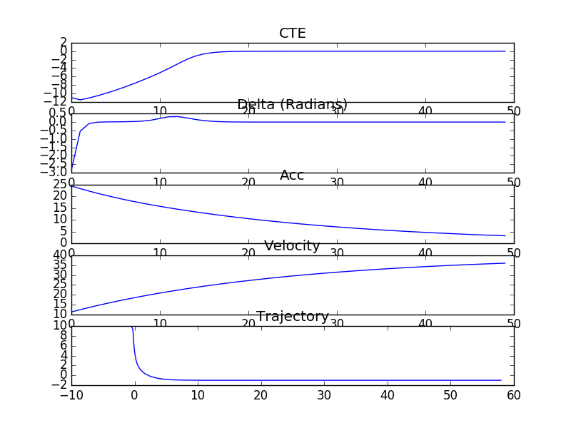

# BFGS
Implementation of Broyden, Fletcher, Goldfarb and Shanno's (BFGS) quasi Newton's method in c++. 

## Installation

```sh
git clone git@github.com:gcjyzdd/BFGS.git
cd NFGS
chmod +x test.sh
./test.sh
```

## Examples

In the [main.cpp](./src/main.cpp), there is an example of applying BFGS to solve model predictive control.

To run the example, type

```sh
./bin/mpc_test
```

The result of MPC is shown below:

<div style="text-align:center"></div>

It takes `4.87416ms` to solve MPC per run on my PC.

## Dependencies

Eigen-3.3 or later.
